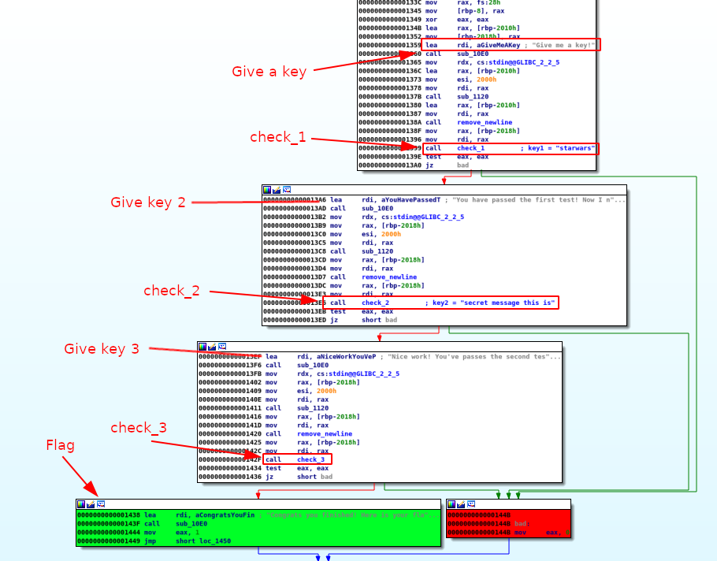

# Cracker Barrel (50)

## Instructions

I found a USB drive under the checkers board at cracker barrel. My friends told me not to plug it in but surely nothing bad is on it?

I found [this file](files/cracker_barrel), but I can't seem to unlock it's secrets. Can you help me out?

Also.. once you think you've got it I think you should try to connect to `challenges.auctf.com` at port `30000` not sure what that means, but it written on the flash drive..

Author: nadrojisk

## Solution

### main

The main function will call the `check` function, and the expected result should be different than `0` to show the flag.

```asm
.text:00000000000012B5                 public main
.text:00000000000012B5 main            proc near               ; DATA XREF: _start+21↑o
.text:00000000000012B5                 endbr64
.text:00000000000012B9                 push    rbp
.text:00000000000012BA                 mov     rbp, rsp
.text:00000000000012BD                 sub     rsp, 10h
.text:00000000000012C1                 mov     [rbp-4], edi
.text:00000000000012C4                 mov     [rbp-10h], rsi
.text:00000000000012C8                 mov     rax, cs:__bss_start
.text:00000000000012CF                 mov     ecx, 0
.text:00000000000012D4                 mov     edx, 2
.text:00000000000012D9                 mov     esi, 0
.text:00000000000012DE                 mov     rdi, rax
.text:00000000000012E1                 call    sub_1150
.text:00000000000012E6                 mov     eax, 0
.text:00000000000012EB                 call    check           ; call check function
.text:00000000000012F0                 test    eax, eax        ; check should return result != 0
.text:00000000000012F2                 jz      short bad
.text:00000000000012F4                 mov     eax, 0
.text:00000000000012F9                 call    print_flag
.text:00000000000012FE                 mov     eax, 0
.text:0000000000001303                 jmp     short locret_1316
.text:0000000000001305 ; ---------------------------------------------------------------------------
.text:0000000000001305
.text:0000000000001305 bad:                                    ; CODE XREF: main+3D↑j
.text:0000000000001305                 lea     rdi, aThatSNotIt ; "That's not it!"
.text:000000000000130C                 call    sub_10E0
.text:0000000000001311                 mov     eax, 1
.text:0000000000001316
.text:0000000000001316 locret_1316:                            ; CODE XREF: main+4E↑j
.text:0000000000001316                 leave
.text:0000000000001317                 retn
.text:0000000000001317 main            endp
```

### check

The `check` function:
* prompts for a 1st key, check it with `check_1`
* prompts for a 2nd key, check it with `check_2`
* prompts for a 3rd key, check it with `check_3`
* show the flag if all keys are correct



### check1

The `check_1` function checks that the user key 1 is equal to "starwars" with the `strcmp` function at offset `0x149A`. The "startrek" string is here to fool the analyst.

```asm
.text:0000000000001466                 public check_1
.text:0000000000001466 check_1         proc near               ; CODE XREF: check+81↑p
.text:0000000000001466                 endbr64
.text:000000000000146A                 push    rbp
.text:000000000000146B                 mov     rbp, rsp
.text:000000000000146E                 sub     rsp, 20h
.text:0000000000001472                 mov     [rbp-18h], rdi  ; user_key1
.text:0000000000001476                 lea     rax, aStarwars  ; "starwars"
.text:000000000000147D                 mov     [rbp-10h], rax
.text:0000000000001481                 lea     rax, aStartrek  ; "startrek"
.text:0000000000001488                 mov     [rbp-8], rax
.text:000000000000148C                 mov     rdx, [rbp-10h]
.text:0000000000001490                 mov     rax, [rbp-18h]
.text:0000000000001494                 mov     rsi, rdx        ; "starwars"
.text:0000000000001497                 mov     rdi, rax        ; user_key1
.text:000000000000149A                 call    strcmp_0        ; strcmp() to check user key 1
.text:000000000000149F                 test    eax, eax
.text:00000000000014A1                 jnz     short bad
.text:00000000000014A3                 mov     rdx, [rbp-8]
.text:00000000000014A7                 mov     rax, [rbp-18h]
.text:00000000000014AB                 mov     rsi, rdx
.text:00000000000014AE                 mov     rdi, rax
.text:00000000000014B1                 call    strcmp_0
.text:00000000000014B6                 test    eax, eax
.text:00000000000014B8                 jnz     short loc_14C1
.text:00000000000014BA                 mov     eax, 0
.text:00000000000014BF                 jmp     short locret_14CD
.text:00000000000014C1 ; ---------------------------------------------------------------------------
.text:00000000000014C1
.text:00000000000014C1 loc_14C1:                               ; CODE XREF: check_1+52↑j
.text:00000000000014C1                 mov     eax, 1
.text:00000000000014C6                 jmp     short locret_14CD
.text:00000000000014C8 ; ---------------------------------------------------------------------------
.text:00000000000014C8
.text:00000000000014C8 bad:                                    ; CODE XREF: check_1+3B↑j
.text:00000000000014C8                 mov     eax, 0
.text:00000000000014CD
.text:00000000000014CD locret_14CD:                            ; CODE XREF: check_1+59↑j
.text:00000000000014CD                                         ; check_1+60↑j
.text:00000000000014CD                 leave
.text:00000000000014CE                 retn
.text:00000000000014CE check_1         endp
```

First key: `starwars`

### check2

The `check_2` function sets a string ("si siht egassem terces") and compares each byte of the user entry in the reverse order. Hence, the key is the reverse string.

```asm
.text:00000000000014CF                 public check_2
.text:00000000000014CF check_2         proc near               ; CODE XREF: check+CE↑p
.text:00000000000014CF                 endbr64
.text:00000000000014D3                 push    rbp
.text:00000000000014D4                 mov     rbp, rsp
.text:00000000000014D7                 sub     rsp, 30h
.text:00000000000014DB                 mov     [rbp-28h], rdi
.text:00000000000014DF                 lea     rax, aSiSihtEgassemT ; "si siht egassem terces"
.text:00000000000014E6                 mov     [rbp-10h], rax
.text:00000000000014EA                 mov     rax, [rbp-28h]
.text:00000000000014EE                 mov     rdi, rax
.text:00000000000014F1                 call    sub_10F0
.text:00000000000014F6                 mov     [rbp-14h], eax
.text:00000000000014F9                 mov     eax, [rbp-14h]
.text:00000000000014FC                 add     eax, 1
.text:00000000000014FF                 cdqe
.text:0000000000001501                 shl     rax, 3
.text:0000000000001505                 mov     rdi, rax
.text:0000000000001508                 call    sub_1140
.text:000000000000150D                 mov     [rbp-8], rax
.text:0000000000001511                 mov     dword ptr [rbp-18h], 0 ; i = 0
.text:0000000000001518                 jmp     short loc_1543
.text:000000000000151A ; ---------------------------------------------------------------------------
.text:000000000000151A
.text:000000000000151A loop:                                   ; CODE XREF: check_2+7A↓j
.text:000000000000151A                 mov     eax, [rbp-14h]
.text:000000000000151D                 sub     eax, 1
.text:0000000000001520                 sub     eax, [rbp-18h]
.text:0000000000001523                 movsxd  rdx, eax
.text:0000000000001526                 mov     rax, [rbp-10h]  ; "si siht egassem terces"
.text:000000000000152A                 add     rax, rdx
.text:000000000000152D                 mov     edx, [rbp-18h]
.text:0000000000001530                 movsxd  rcx, edx
.text:0000000000001533                 mov     rdx, [rbp-8]
.text:0000000000001537                 add     rdx, rcx
.text:000000000000153A                 movzx   eax, byte ptr [rax]
.text:000000000000153D                 mov     [rdx], al
.text:000000000000153F                 add     dword ptr [rbp-18h], 1 ; i += 1
.text:0000000000001543
.text:0000000000001543 loc_1543:                               ; CODE XREF: check_2+49↑j
.text:0000000000001543                 mov     eax, [rbp-18h]
.text:0000000000001546                 cmp     eax, [rbp-14h]
.text:0000000000001549                 jl      short loop
.text:000000000000154B                 mov     rdx, [rbp-28h]
.text:000000000000154F                 mov     rax, [rbp-8]
.text:0000000000001553                 mov     rsi, rdx
.text:0000000000001556                 mov     rdi, rax
.text:0000000000001559                 call    strcmp_0
.text:000000000000155E                 test    eax, eax
.text:0000000000001560                 jz      short bad
.text:0000000000001562                 mov     eax, 0
.text:0000000000001567                 jmp     short locret_156E
.text:0000000000001569 ; ---------------------------------------------------------------------------
.text:0000000000001569
.text:0000000000001569 bad:                                    ; CODE XREF: check_2+91↑j
.text:0000000000001569                 mov     eax, 1
.text:000000000000156E
.text:000000000000156E locret_156E:                            ; CODE XREF: check_2+98↑j
.text:000000000000156E                 leave
.text:000000000000156F                 retn
.text:000000000000156F check_2         endp
```

Second key: `secret message this is`


### check3

The `check3` function will add `0x2` to each character of the user input (3rd key) and will XOR it with `0x14`:

```asm
.text:00000000000015FB mov     eax, [rbp-54h]
.text:00000000000015FE movsxd  rdx, eax
.text:0000000000001601 mov     rax, [rbp-68h]
.text:0000000000001605 add     rax, rdx
.text:0000000000001608 movzx   eax, byte ptr [rax]
.text:000000000000160B movsx   eax, al
.text:000000000000160E lea     edx, [rax+2]    ; user_input[i]+2
.text:0000000000001611 mov     eax, [rbp-54h]
.text:0000000000001614 cdqe
.text:0000000000001616 lea     rcx, ds:0[rax*4]
.text:000000000000161E mov     rax, [rbp-48h]
.text:0000000000001622 add     rax, rcx
.text:0000000000001625 xor     edx, 14h        ; (user_input[i]+2) ^ 0x14
.text:0000000000001628 mov     [rax], edx
.text:000000000000162A add     dword ptr [rbp-54h], 1 ; i += 1
.text:000000000000162E
.text:000000000000162E loc_162E:
.text:000000000000162E mov     eax, [rbp-54h]
.text:0000000000001631 movsxd  rbx, eax
.text:0000000000001634 mov     rax, [rbp-68h]
.text:0000000000001638 mov     rdi, rax
.text:000000000000163B call    sub_10F0
.text:0000000000001640 cmp     rbx, rax
.text:0000000000001643 jb      short loop_1
.text:0000000000001645 mov     dword ptr [rbp-50h], 0
.text:000000000000164C mov     dword ptr [rbp-4Ch], 0
.text:0000000000001653 jmp     short loc_1683
```

The result should be equal to the string defined in the beginning of the function:

```asm
.text:0000000000001590                 mov     dword ptr [rbp-40h], 7Ah ; 'z'
.text:0000000000001597                 mov     dword ptr [rbp-3Ch], 21h ; '!'
.text:000000000000159E                 mov     dword ptr [rbp-38h], 21h ; '!'
.text:00000000000015A5                 mov     dword ptr [rbp-34h], 62h ; 'b'
.text:00000000000015AC                 mov     dword ptr [rbp-30h], 36h ; '6'
.text:00000000000015B3                 mov     dword ptr [rbp-2Ch], 7Eh ; '~'
.text:00000000000015BA                 mov     dword ptr [rbp-28h], 77h ; 'w'
.text:00000000000015C1                 mov     dword ptr [rbp-24h], 6Eh ; 'n'
.text:00000000000015C8                 mov     dword ptr [rbp-20h], 26h ; '&'
.text:00000000000015CF                 mov     dword ptr [rbp-1Ch], 60h ; '`'
.text:00000000000015D6                 mov     rax, [rbp-68h]
```

To reverse the function, we can use the following python script:

```python
>>> a = [0x7A, 0x21, 0x21, 0x62, 0x36, 0x7E, 0x77, 0x6E, 0x26, 0x60]
>>> print(''.join([chr((i^0x14)-0x2) for i in a]))
l33t hax0r
```

Third key: `l33t hax0r`

## Flag

When we provide the program with the expected keys, we don't get the flag because we are not running the program on the server:

~~~
$ ./cracker_barrel 
Give me a key!
starwars
You have passed the first test! Now I need another key!
secret message this is
Nice work! You've passes the second test, we aren't done yet!
l33t hax0r
Congrats you finished! Here is your flag!
Too bad you can only run this exploit on the server...
~~~

This is because the program is looking for a `flag.txt` file:

```asm
.text:00000000000016C7                 public print_flag
.text:00000000000016C7 print_flag      proc near               ; CODE XREF: main+44↑p
.text:00000000000016C7                 endbr64
.text:00000000000016CB                 push    rbp
.text:00000000000016CC                 mov     rbp, rsp
.text:00000000000016CF                 sub     rsp, 120h
.text:00000000000016D6                 mov     rax, fs:28h
.text:00000000000016DF                 mov     [rbp-8], rax
.text:00000000000016E3                 xor     eax, eax
.text:00000000000016E5                 lea     rsi, aR         ; "r"
.text:00000000000016EC                 lea     rdi, aFlagTxt   ; "flag.txt"
.text:00000000000016F3                 call    sub_1160
.text:00000000000016F8                 mov     [rbp-118h], rax
.text:00000000000016FF                 cmp     qword ptr [rbp-118h], 0
.text:0000000000001707                 jnz     short loc_171F
.text:0000000000001709                 lea     rdi, aTooBadYouCanOn ; "Too bad you can only run this exploit o"...
.text:0000000000001710                 call    sub_10E0
.text:0000000000001715                 mov     edi, 0
.text:000000000000171A                 call    sub_1170
.text:000000000000171F
.text:000000000000171F loc_171F:                               ; CODE XREF: print_flag+40↑j
.text:000000000000171F                 mov     rdx, [rbp-118h]
.text:0000000000001726                 lea     rax, [rbp-110h]
.text:000000000000172D                 mov     esi, 100h
.text:0000000000001732                 mov     rdi, rax
.text:0000000000001735                 call    sub_1120
.text:000000000000173A                 lea     rax, [rbp-110h]
.text:0000000000001741                 mov     rsi, rax
.text:0000000000001744                 lea     rdi, aS         ; "%s"
.text:000000000000174B                 mov     eax, 0
.text:0000000000001750                 call    sub_1110
.text:0000000000001755                 nop
.text:0000000000001756                 mov     rax, [rbp-8]
.text:000000000000175A                 xor     rax, fs:28h
.text:0000000000001763                 jz      short locret_176A
.text:0000000000001765                 call    sub_1100
.text:000000000000176A
.text:000000000000176A locret_176A:                            ; CODE XREF: print_flag+9C↑j
.text:000000000000176A                 leave
.text:000000000000176B                 retn
.text:000000000000176B print_flag      endp
```

If we create a fake flag and restart the program, it works:

~~~
$ echo "auctf{fake_flag}" > flag.txt
$ ./cracker_barrel 
Give me a key!
starwars
You have passed the first test! Now I need another key!
secret message this is
Nice work! You've passes the second test, we aren't done yet!
l33t hax0r
Congrats you finished! Here is your flag!
auctf{fake_flag}
~~~

At the time of this writing, I was not able to connect to the server to get the flag:

~~~
$ nc challenges.auctf.com 30000
Ncat: Could not resolve hostname "challenges.auctf.com": Name or service not known. QUITTING.
~~~
